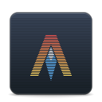

# Appcons Theme

A small but growing collection of vector icons for popular applications that strives to better mesh with the visual language of elementary OS.
This theme is designed to be installed on top of and extend the regular [icons theme](https://github.com/elementary/icons) for elementary OS.

_designed for elementary OS_

## Building and Installation

You'll need the following dependencies:

* meson
* rsvg

Run `meson` to configure the build environment and then `ninja` to build

    meson build --prefix=/usr
    cd build
    ninja

To install, use `ninja install`

    sudo ninja install
